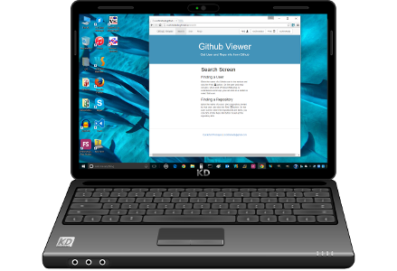
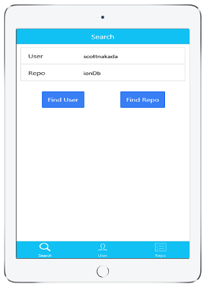

<h1>Github Viewer App</h1>

 
  

    
    &nbsp;&nbsp;&nbsp;
    
  

 

<h2>What does this app do</h2>
  <h4>
    

      This app accesses the Github API, and retrieves Github User and Repository information.
    

  </h4>
  <h2>Finding a User</h2>
    <h4>
      

        Enter the name of a Github user in the navbar and click the
        Find User button. On the user and repo screens, when a list of follows/following, or
        contributors comes up, you can click on a button to select that user.
      

    </h4>

  <h2>Finding a Repository</h2>
    <h4>
      

        Enter the name of a user, and a repository owned by that user, and click
        the Find Repository button. On the user screen, where the repositories are listed, you can click
        on the Repo link button to pull up the repository info.
      

    </h4>

  <h2>Getting the App</h2>
    <h4>
      

        This app is available three ways:
      

      <ol>
        <li>
          
          On the <a href="http://scottnakada.github.io/GitViewer/yoGitViewer/dist/public/index.html">web</a>:  
        </li>
        <li>
          
          On Android devices through the
          <a href="http://www.amazon.com/Quickstart-Prototypes-GitViewer/dp/B0144CR3GI/ref=sr_1_1?s=mobile-apps&ie=UTF8&qid=1440007082&sr=1-1&keywords=gitviewer">
            Amazon Apps Store
          </a>.
        </li>
        <li>
          
          On Apple devices (iPhone/iPad), by downloading an app called Ionic View, and selecting the
          app id: <a href="http://scottnakada.github.io/GitViewer/index.html#ios">16ef8c8e</a>:  
        </li>
      </ol>
    </h4>
